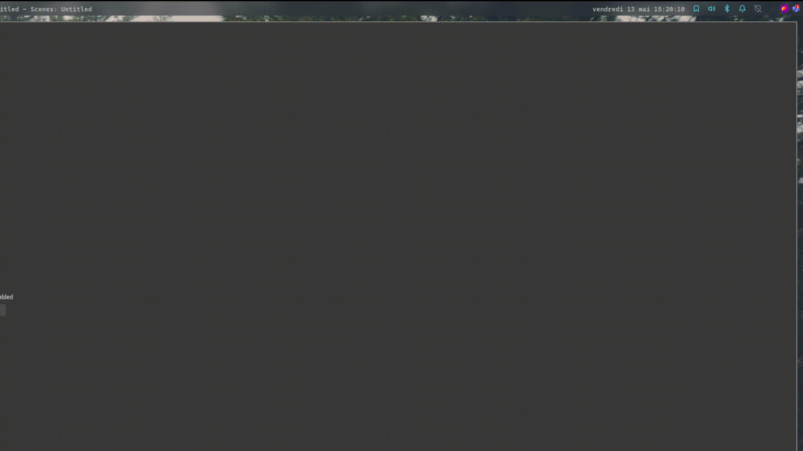

# Vpn Polybar

VPN module for openfortivpn and openvpn to view status and toggle vpn
## Dependencies
- OpenVPN | OpenFortiVPN
- Yad (Yet Another Display)
- Polkit

## Usage

The script expects parameters :
 - `vpn_status.sh` display the status of vpn :
    - No VPN connection : 
    - Vpn connected (the name is config file name) : 
 - `vpn_toggle.sh` toogle vpn connection :
    - Check if a openvpn or openfortivpn is running
    - If a process is running, display Yad as kill window (no exit button, just close on unfocus)
    - if not, open Yad as file path grabber and connect start a process

Example module for polybar

```ini
[module/vpn]

type = custom/script
interval = 1
exec = ~/.config/polybar/scripts/vpn_status.sh
click-left = ~/.config/polybar/scripts/vpn_toggle.sh

```
## Demo
